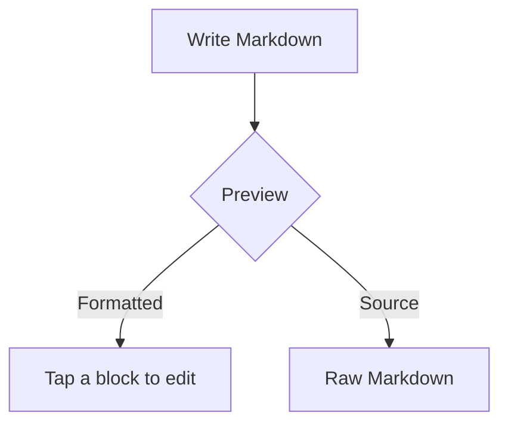

# Scratch-style Markdown Editor

This editor keeps Markdown as source while giving you formatted blocks. Try **bold**, *italic*, `inline code`, links, and [[Daily Notes]].

- [x] Toolbar commands
- [x] Slash commands
- [x] Wikilink autocomplete
- [ ] Keep iterating on full WYSIWYG parity

> Use the search icon to find `Mermaid`, or press Cmd/Ctrl+F.



$$
E = mc^2
$$

```dart
void main() {
  print('SmoothMarkdownEditor');
}
```

| Feature | Status |
|---|---|
| Copy HTML | Done |
| Export Markdown | Callback |
| Focus mode | Done |
