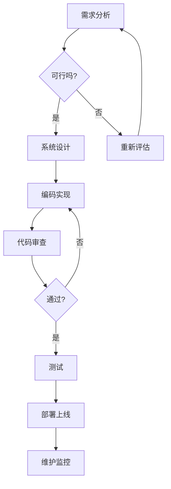
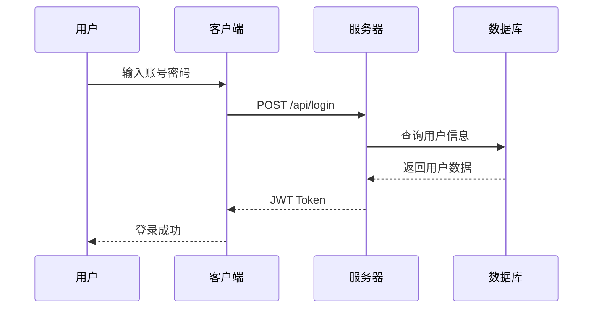
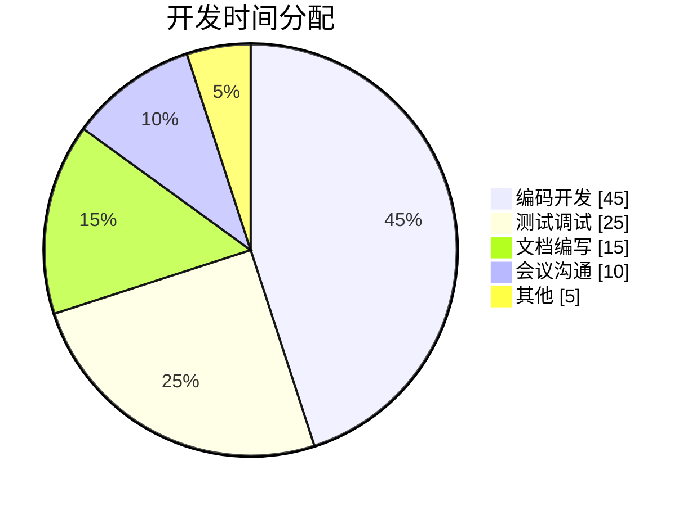
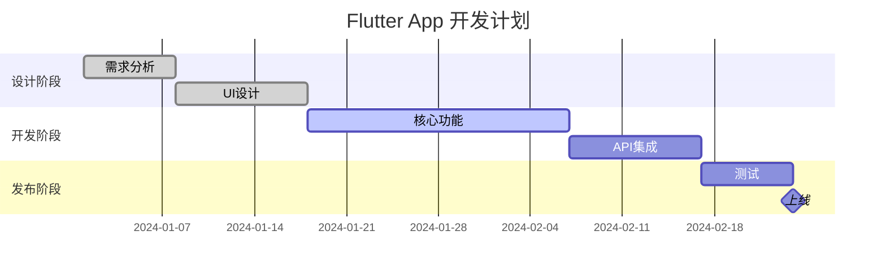

# 🚀 完整 Markdown 功能展示

欢迎来到 **Flutter Smooth Markdown** 的完整功能演示页面！这里展示了所有支持的 Markdown 语法和增强 UI 组件。


## 一、标题层级展示

所有六级标题都支持，增强模式下 H1 和 H2 带有彩色装饰和渐变边框。

# H1 - 一级标题
## H2 - 二级标题
### H3 - 三级标题
#### H4 - 四级标题
##### H5 - 五级标题
###### H6 - 六级标题

### 1.1 标题中的行内格式 ✨ 新功能

标题现在支持所有行内格式，包括粗体、斜体、代码、链接等！

## 📝 **我的建议** - 粗体标题

### 这是 *斜体* 文本的标题

### **粗体** 和 *斜体* 混合标题

### 使用 `代码` 的标题示例

### 查看 [Flutter 文档](https://flutter.dev) 获取更多信息

### 🎉 **庆祝活动** 现在 *开始* 啦！

### ⚡ 性能 **优化** 指南 `v2.0`

### 🚀 **快速开始**: 运行 `flutter create` 创建项目

---

## 二、文本样式

### 2.1 基础文本样式

你可以使用 **粗体文本** 来强调重要内容，使用 *斜体文本* 来表达语气，使用 ~~删除线~~ 来标记废弃内容，还可以使用 `行内代码` 来标记代码片段。

### 2.2 混合样式

这是一个包含 **粗体**、*斜体*、`代码`、~~删除线~~ 和 [链接](https://flutter.dev) 的混合段落。你甚至可以写 ***粗斜体*** 文本！

---

## 三、代码展示

### 3.1 Dart 代码

增强的代码块支持复制按钮、语言标签和悬停效果（移动端复制按钮始终显示）：

```dart
// Flutter 应用入口
void main() {
  runApp(const MyApp());
}

class MyApp extends StatelessWidget {
  const MyApp({super.key});

  @override
  Widget build(BuildContext context) {
    return MaterialApp(
      title: 'Flutter Smooth Markdown',
      theme: ThemeData(
        colorScheme: ColorScheme.fromSeed(seedColor: Colors.blue),
        useMaterial3: true,
      ),
      home: const HomePage(),
    );
  }
}

// 使用增强组件渲染 Markdown
class HomePage extends StatelessWidget {
  const HomePage({super.key});

  @override
  Widget build(BuildContext context) {
    return Scaffold(
      appBar: AppBar(title: const Text('Markdown Demo')),
      body: SmoothMarkdown(
        data: '# Hello **World**\\n\\nThis is *amazing*!',
        useEnhancedComponents: true,
        styleSheet: MarkdownStyleSheet.github(),
      ),
    );
  }
}
```

### 3.2 JavaScript 代码

```javascript
// 现代 JavaScript 异步编程
async function fetchUserData(userId) {
  try {
    const response = await fetch('/api/users/' + userId);
    const data = await response.json();

    return {
      ...data,
      timestamp: new Date().toISOString(),
      status: 'success'
    };
  } catch (error) {
    console.error('Error fetching user:', error);
    throw new Error('Failed to load user ' + userId);
  }
}

// 使用箭头函数和解构
const processUsers = users => users
  .filter(({ active }) => active)
  .map(({ id, name, email }) => ({ id, name, email }))
  .sort((a, b) => a.name.localeCompare(b.name));
```

### 3.3 Python 代码

```python
# Python 数据处理示例
import pandas as pd
import numpy as np
from typing import List, Dict, Optional

class DataAnalyzer:
    """强大的数据分析器"""

    def __init__(self, data: pd.DataFrame):
        self.data = data
        self.results: Dict[str, any] = {}

    def analyze(self, columns: List[str]) -> Dict[str, float]:
        """分析指定列的统计信息"""
        stats = {}
        for col in columns:
            if col in self.data.columns:
                stats[col] = {
                    'mean': self.data[col].mean(),
                    'median': self.data[col].median(),
                    'std': self.data[col].std(),
                    'min': self.data[col].min(),
                    'max': self.data[col].max()
                }
        return stats

    @staticmethod
    def normalize(values: np.ndarray) -> np.ndarray:
        """归一化数值"""
        return (values - values.min()) / (values.max() - values.min())

# 使用示例
df = pd.read_csv('data.csv')
analyzer = DataAnalyzer(df)
results = analyzer.analyze(['price', 'quantity', 'rating'])
print(f"Analysis complete: {len(results)} columns processed")
```

### 3.4 行内代码

在段落中使用 `const variable = 'value'` 这样的行内代码，或者 `npm install package-name` 这样的命令。

---

## 四、列表功能

### 4.1 无序列表

购物清单：
- 新鲜水果
  - 苹果 🍎
  - 香蕉 🍌
  - 橙子 🍊
- 蔬菜
  - 西红柿 🍅
  - 黄瓜 🥒
  - 胡萝卜 🥕
- 日用品
  - 洗发水
  - 牙膏
  - 纸巾

### 4.2 有序列表

开发流程：
1. **需求分析**
   1. 收集用户需求
   2. 编写需求文档
   3. 评审和确认
2. **设计阶段**
   1. UI/UX 设计
   2. 架构设计
   3. 数据库设计
3. **开发实现**
   1. 编码实现
   2. 单元测试
   3. 代码审查
4. **测试部署**
   1. 集成测试
   2. 性能测试
   3. 生产部署

### 4.3 任务列表

项目进度：
- [x] ✅ 完成项目初始化
- [x] ✅ 实现 Markdown 解析器
- [x] ✅ 创建渲染引擎
- [x] ✅ 添加增强 UI 组件
- [x] ✅ 支持多主题切换
- [ ] ⏳ 实现流式渲染
- [ ] ⏳ 添加语法高亮
- [ ] 📋 性能优化
- [ ] 📋 编写完整文档

---

## 五、引用块

### 5.1 单行引用

> 简洁是智慧的灵魂。 —— 莎士比亚

### 5.2 多行引用

增强的引用块带有引号图标、渐变背景和阴影效果：

> **关于优秀代码的思考**
>
> 任何傻瓜都能写出计算机能理解的代码。
> 优秀的程序员能写出人类能理解的代码。
>
> 代码是写给人看的，只是顺便让机器执行而已。
>
> —— Martin Fowler

### 5.3 嵌套引用

> 这是第一层引用
>
> > 这是第二层嵌套引用
> >
> > > 这是第三层嵌套引用
> > > 包含多种层级的内容
> >
> > 回到第二层
>
> 回到第一层引用

---

## 六、链接展示

### 6.1 外部链接

增强的链接带有悬停动画和外部链接图标：

- [Flutter 官方网站](https://flutter.dev) - 学习 Flutter 开发
- [Dart 语言官网](https://dart.dev) - Dart 编程语言
- [GitHub](https://github.com) - 代码托管平台
- [Stack Overflow](https://stackoverflow.com) - 开发者问答社区
- [pub.dev](https://pub.dev) - Flutter/Dart 包管理

### 6.2 内部链接

- [跳转到顶部](#-完整-markdown-功能展示)
- [查看代码示例](#三代码展示)
- [查看列表功能](#四列表功能)

### 6.3 链接和文本混合

访问 [Flutter Smooth Markdown](https://github.com/JackCaow/flutter-smooth-markdown) 项目了解更多信息。这个包提供了 **高性能** 的 Markdown 渲染，支持 *增强 UI 组件* 和 `流式渲染`。

---

## 七、分隔线

使用三个或更多连字符创建分隔线：

---

上面和下面都有分隔线！

---

## 八、图片展示

### 8.1 网络图片


### 8.2 带标题的图片


### 8.3 SVG 矢量图


> SVG 图片支持自动缩放，不会失真，完美适配各种屏幕尺寸。

---

## 九、表格

| 功能 | 标准组件 | 增强组件 | 说明 |
|------|---------|---------|------|
| 代码块 | ✅ | ✅ 复制按钮 | 支持语法高亮 |
| 引用 | ✅ | ✅ 图标装饰 | 渐变背景 |
| 链接 | ✅ | ✅ 悬停动画 | 外链图标 |
| 标题 | ✅ | ✅ 彩色标记 | 渐变边框 |

### 表格对齐示例

| 左对齐 | 居中对齐 | 右对齐 |
|:-------|:-------:|-------:|
| 左     | 中      | 右     |
| Left   | Center  | Right  |
| 数据1  | 数据2   | 数据3  |

### 复杂表格示例

| 编程语言 | 类型 | 发布年份 | 主要用途 |
|---------|:----:|:--------:|---------|
| **Python** | 动态 | 1991 | AI、数据科学、Web |
| **JavaScript** | 动态 | 1995 | Web 前端、后端 |
| **Dart** | 静态 | 2011 | Flutter 应用开发 |
| **Rust** | 静态 | 2010 | 系统编程、性能 |

---

## 十、综合示例

### 10.1 技术文档示例

**函数说明：** `calculateDistance()`

计算两点之间的欧几里得距离。

**参数：**
- `point1` (*Object*): 第一个点，包含 `x` 和 `y` 坐标
- `point2` (*Object*): 第二个点，包含 `x` 和 `y` 坐标

**返回值：**
- (*Number*): 两点之间的距离

**示例代码：**

```javascript
const distance = calculateDistance(
  { x: 0, y: 0 },
  { x: 3, y: 4 }
);
console.log(distance); // 输出: 5
```

> **注意：** 此函数假设使用笛卡尔坐标系。

---

## 十、Mermaid 图表

Mermaid 是一种基于文本的图表绘制工具，支持流程图、时序图、饼图、甘特图等多种类型。

### 10.1 流程图 (Flowchart)

展示软件开发流程：



### 10.2 时序图 (Sequence Diagram)

展示用户认证流程：



### 10.3 饼图 (Pie Chart)

展示项目时间分配：



### 10.4 甘特图 (Gantt Chart)

展示项目里程碑：



---

## 十一、功能总结

本页面展示了以下所有功能：

### ✅ 已实现
1. **标题** - 6 级标题，H1/H2 带装饰
2. **文本样式** - 粗体、斜体、删除线、行内代码
3. **代码块** - 带复制按钮和语言标签
4. **语法高亮** - 代码块语法着色（支持 Dart、JavaScript、Python 等）
5. **列表** - 无序、有序、任务列表
6. **引用** - 单层和嵌套引用
7. **链接** - 悬停动画和外链图标
8. **图片** - 网络图片加载，支持 PNG/JPEG/GIF/WebP/SVG
9. **分隔线** - 水平分隔线
10. **表格** - 完整的 GFM 表格支持，带对齐
11. **流式渲染** - 实时内容更新（侧边栏"演示"部分查看）
12. **数学公式** - LaTeX 数学表达式（侧边栏"演示"部分查看）
13. **脚注** - 文档脚注支持，支持自定义样式（侧边栏"演示"部分查看）
14. **主题** - 6 种预设主题
15. **Mermaid 图表** - 流程图、时序图、饼图、甘特图

---

## 🎉 结语

感谢使用 **Flutter Smooth Markdown**！

如果你喜欢这个项目，请：
- ⭐ 在 [GitHub](https://github.com/JackCaow/flutter-smooth-markdown) 上给个星标
- 📢 分享给更多开发者
- 🐛 报告问题和建议
- 💡 贡献代码和想法

**Happy Coding!** 🚀✨
